# Information Retrieval

# 1. Mô hình Vector Space
Ý tưởng của mô hình Vector Space là biểu diễn văn bản và các câu truy vấn dưới dạng các vector term với cơ sở rằng nếu 2 vector trong không gian càng gần nhau thì độ liên quan giữa câu truy vấn đó và tài liệu tương ứng càng cao.

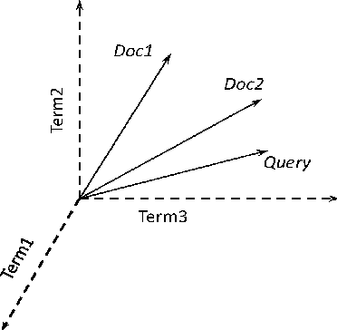

Ví dụ:

Tập tài liệu gồm:

- d1: today big

- d2: small today

Giả sử term tìm được trong tập tài liệu trên là today, big, small.

Tài liệu d1 sẽ được biểu diễn bằng vector có 3 trọng số: [W_today, W_big, W_small ]

Tương tự tài liệu d2 cũng sẽ được biểu diễn tương tự [ W1_today, W1_big, W1_small ]

Điều này cũng sẽ được áp dụng tương tự cho câu truy vấn (xem như là một vector) - [Wq_today, Wq_big, Wq_small ]. 

Để xếp hạng các tài liệu liên quan đến câu truy vấn, ta cần tính độ liên quan của câu truy vấn đến từng tài liệu trong cơ sở dữ liệu bằng cách xác định khoảng cách giữa 2 vector (doc - query) hoặc tính góc tạo bởi 2 vector đó. 

## *1.1 Trích xuất các term*
Giai đoạn đầu của quá trình xây dựng một hệ thống truy xuất thông tin đó chính là lọc các term trong bộ dữ liệu thông tin của hệ thống.

Một term có thể được hiểu là yếu tố cấu tạo thành tài liệu và sẽ được xác định tùy theo quan điểm phân tích tài liệu, ví dụ:
- Term là từ: face value -> face, value
- Term là khái niệm: face value -> face value ( mệnh giá )

Đối với project này, nhóm sẽ phân tích term dựa theo quan điểm:
- Term là một từ gốc (có thể không hoặc có nghĩa), không chứa số và kí hiệu đặc biệt: experimental -> experi, /destalling/ -> destal,...

*Quá trình hình thành term*:
- Lọc tất cả các chữ số có trong tài liệu (isdigit).

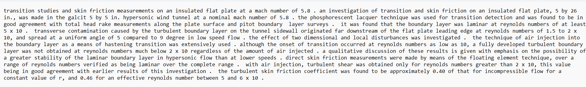

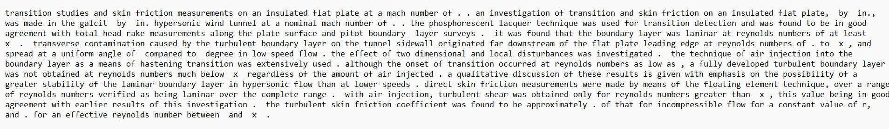

- Sử dụng RegexpTokenizer để chọn những từ nằm trong phạm vi là word (\w+), loại bỏ cái kí hiệu sẽ ảnh hưởng đến những bước tiền xử lí dữ liệu phía sau.

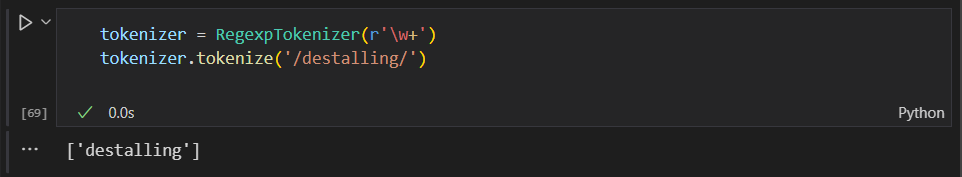

- Loại bỏ các từ stop words. Việc loại bỏ các từ stop words sẽ làm giảm kích cỡ của bộ dữ liệu, đồng thời xóa bỏ đi các từ không mang tính key words và vì các từ đó sẽ lặp lại với tần suất cao nên sẽ ảnh hưởng đến độ chính xác của hệ thống truy xuất.

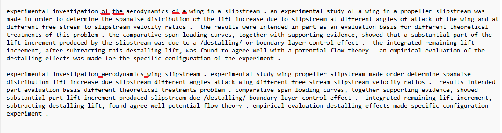

- Đưa từ về từ gốc bằng PorterStemmer. Việc lấy từ gốc sẽ đưa các từ về cùng một trường từ vựng, ví dụ:.....

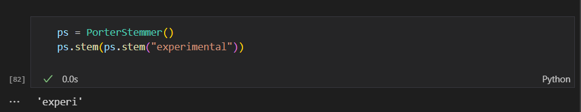

Kết quả sau khi áp dụng quá trình trên

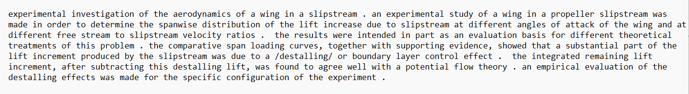

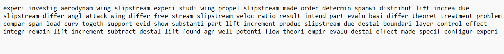

## *1.2 Tính trọng số cho các term*

Cách xác định và tính weights cho vector là hết sức quan trọng, ảnh hưởng đến độ chính xác của các thuật toán xếp hạng. Việc các từ có trọng số khác nhau là do không phải các từ đều có sự quan trọng giống nhau, sử dụng số lần xuất hiện của các từ làm vector không phải là một cách tối ưu. Ở phương diện các documents, một vài từ có thể mang nhiều thông tin hơn các từ còn lại. Có rất nhiều cách để xác định trọng số term:

- Weight = tần số (tf): từ nào xuất hiện nhiều trong tài liệu thì càng quan trọng. Tuy nhiên, nếu có n thể hiện của một term trong tài liệu thì cũng không có ý nghĩa khẳng định rằng tài liệu đó quan trọng gấp n lần so với tài liệu khác.

- Weight = nghịch đảo tần số (idf): đây là cơ chế giảm ảnh hưởng của một term nếu nó xuất hiện quá nhiều lần trong bộ tài liệu. Trọng số idf là nghịch đảo của tuần suất xuất hiện của các từ trong các tài liệu. 

idf = log10(N+1/nk) 

Với nk là số tài liệu chứa term ở chiều thứ k. 

- Weight = tf.idf: kết hợp 2 độ đo trên, từ vừa xuất hiện nhiều lần trong câu, vừa không phải là từ phổ biến xuất hiện trong mọi câu.
    - Weight đạt giá trị lớn nhất khi: term đó xuất hiện nhiều lần trong một số lượng nhỏ tài liệu.
    - Thấp hơn khi t xuất hiện ít trong một tài liệu hoặc xuất hiện nhiều trong các tài liệu. 
    - Nhỏ nhất khi t xuất hiện trong mọi tài liệu,

Ví dụ:

- Tài liệu d1: [ 0.18, 0.48, 0 ]

- Tài liệu d2: [ 0.18, 0, 0.48 ]

Nhằm khắc phục tình trạng khác biệt giữa tài liệu dài và tài liệu ngắn, ta cần chuẩn hóa các trọng số vector về miền trọng số [0,1] bằng cách chia cho căn tổng bình phương trọng số các term.

Ví dụ:

- Tài liệu d1: [ 0.35, 0.94, 0 ]

- Tài liệu d2: [ 0.35, 0, 0.94 ]

## *1.3. Lập chỉ mục*
Ở bước này sẽ sử dụng các term để mô tả góc nhìn logic của tài liệu để xây dựng các chỉ mục nhằm tăng tốc độ truy nhập. 

Cấu trúc chỉ mục sẽ có dạng: word -> từ điển -> posting list.

Từ điển sẽ chứa các thông tin: số lượng tài liệu chứa từ vựng và số lần xuất hiện của từ vựng đó trong toàn bộ tập lưu trữ.

Posting list gồm: chứa chỉ số tài liệu, số lần xuất hiện của một từ khóa trong tài liệu đó và số weight.

Ví dụ: Tập tài liệu gồm:

d1: today big

d2: small today

Chỉ mục sẽ có dạng:

- today: {'So_luong_tai_lieu': 2, 'Tan_so': 2, 'Posting': [[1, 1, 0.35], [2, 1, 0.35] ]}
- big: {'So_luong_tai_lieu': 1, 'Tan_so': 1, 'Posting': [[1, 1,  0.94] ]}
- small: {'So_luong_tai_lieu': 1, 'Tan_so': 1, 'Posting': [[2, 1, 0.94] ]}

## *1.4. Xử lý truy vấn*

Ở bước đầu trong giai đoạn truy xuất của hệ thống, câu truy vấn sẽ được xử lý tương tự như tài liệu, tức là quy trình lọc chữ số -> loại bỏ các kí hiệu ...-> hình thành các terms. 

Đối với mỗi terms trong câu truy vấn, ta cần xác đinh vị trí của nó trong chỉ mục:

+ Nếu term đó không có trong chỉ mục: term lạ chưa từng xuất hiện một lần nào trong các tài liệu -> bỏ quả vì term này sẽ không mang ý nghĩa.

+ Nếu term đó có trong chỉ mục: xác định tần số term này trong câu truy vấn. Sau đó thực hiện việc tính trọng số tương tự như các tài liệu. Tức là lấy tần số của term đó trong câu nhân với idf của term đó trong tập tài liệu. 

Ví dụ với câu truy vấn: today big big too small.

Câu truy vấn sẽ được biểu diễn dưới dạng: [W_today, W_big, W_small ] (bỏ từ too vì không có trong tài liệu)

Tiếp đến ta tính weights cho truy vấn: 
    
[1*log10(2+1/2) , 2*log10(2+1/1), 1*log10(2+1/1)]

= [0.18, 0.95, 0.48]

Sau khi đã biểu diễn câu truy vấn thành vector đồng dạng với các vector tài liệu. Để tính toán độ tương đồng giữa câu truy vấn và tài liệu, ta sẽ sử dụng Cosine để tính giá trị liên quan, sau đó xếp hạng các tài liệu từ cao đến thấp [1, -1] với công thức.
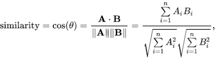

Ví dụ:

- Tài liệu d1: [ 0.35, 0.94, 0 ]

- Tài liệu d2: [ 0.35, 0, 0.94 ]

- Câu truy vấn: [ 0.18, 0.95, 0.48 ]

Ta có: 

rel1 = cos(d1,query) = 0.88428685

rel2 = cos(d2,query) = 0.47033613

Từ kết quả trên ta thấy rằng, tài liệu 1 có độ liên quan lớn hơn với tài liệu 2 và ta xếp hạng [doc1, doc2].

Hình ảnh dưới đây mô tả lại quy trình hoạt động của mô hình Vector Space.

## *1.5. Đánh giá mô hình Vector Space*
### Ưu điểm

Dễ hiểu và dễ cài đặt.

Có nhiều các tính trọng số và độ liên quan khác nhau.

### Nhược điểm

Phải cân nhắc lựa chọn các cách tính phù hợp.

# Mô hình BIM
Mô hình độc lập nhị phân ( Binary Independence Model ) là mô hình truy xuất thông tin dựa trên xác suất. Sự liên quan của truy vấn và tài liệu được biểu diễn sẽ được thể hiện trong biến nhị phân:
- R = 1 - d,q có liên quan.
- R = 0 - d,q không liên quan.

Kết quả xếp hạng sẽ được sắp xếp theo thứ tự giảm dần của xác suất p(R=1|d,q) ( xác suất để d,q có liên quan nhau là p ). Một khác xếp hạng khác là ta có thể xếp hạng theo odds.

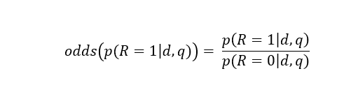

Từ biểu thức trên, ta áp dụng quy tắc Bayes với 3 sự kiện

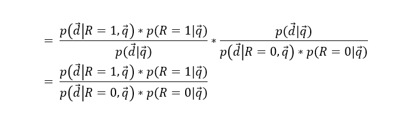

Trong đó, p(R=1|q) và p(R=0|q) là hằng số, do đó, việc xếp hạng bây giờ sẽ phụ thuộc vào 2 giá trị p(d|R=1,q) và p(d|R=0,q), tỉ số giữa 2 giá trị này được gọi là trọng số của term (sẽ trình bày ở mục 2).

Với mô hình BIM tồn tại các giả định đển việc ước lượng 2 giá trị trên đơn giản và hiệu quả:

- Các term trong một tài liệu và một truy vấn độc lập với nhau.

- Xác suất của một term xuất hiện trong các tài liệu liên quan không ảnh hưởng đến xác suất của các term khác trong các tài liệu liên quan.

Từ đó ta có

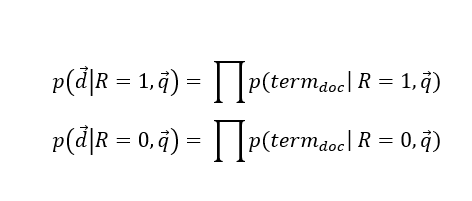

Và giả định:

- Các term của câu truy vấn là yếu tố duy nhất xác định sự liên quan giữa tài liệu và truy vấn. Giả sử với term i của tài liệu không có trong câu truy vấn thì:

p(term_i|q, R = 1 ) = p(term_i|q, R = 0 ) 

Do đó ta chỉ cần tính những term thuộc câu truy vấn, vậy sự liên quan của tài liệu và truy vấn sẽ được thể hiện như sau:

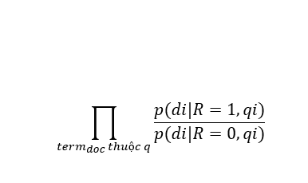

## *2.1 Trích xuất các term*
Tương tư như mô hình Vector Space.

## *2.2 Tính trọng số cho các term*
Việc tính weight các term sẽ được tính theo 2 trường hợp:
- Trường hợp chúng ta không có thông tin rằng tài liệu nào là có liên quan hoặc không. Thông tin duy nhất chúng ta biết là từ câu truy vấn và ta không có cách nào để ước tính được term của câu truy vấn xuất hiện như thế nào (tần số) trong các tài liệu liên quan, do đó, ta có 2 giả định:
    - Term của truy vấn xuất hiện hay không xuất hiện trong tài liệu liên quan là như nhau: p(term_i|q, R = 1 ) = 0.5
    -  Xác suất term xuất hiện trong tài liệu không liên quan tỉ lệ thuận với số tài liệu chứa term trong tập tài liệu: p(term_i|q, R = 0 ) = Số tài liệu chứa term / tổng số tài liệu.

Ví dụ:

Tập tài liệu:
- d1: today big
- d2: small today
- Câu truy vấn: today big small

|                     | today | big | small |
|:-------------------:|:-----:|:---:|:-----:|
| p(term_doc \|R=1,q) |  0.5  | 0.5 |  0.5  |
| p(term_doc \|R=0,q) |   1   | 0.5 |  0.5  |
|        weight       |  0.5  |  1  |   1   |

- Trường hợp chúng ta biết được một số thông tin về các tài liệu liên quan (tập training, phản hồi từ người dùng,...).
    - Gọi Rt là số tài liệu mà người dùng đánh giá là có liên quan chứa term t.
    - Gọi Nr là tổng số tài liệu đánh giá là có liên quan.

   Lúc này, p(term_i|q, R = 1 ) = Rt/Nr = (Rt+0.5) / (Nr+1) (smoothing để tránh Rt = 0 hoặc Rt = Nt ).

   Và p(term_i|q, R = 0 ) =  (Nt-Rt)/(N-Nr) = (Nt-Rt + 0.5)/(N-Nr + 1) (smoothing) với Nt là tổng số tài liệu chứa term.

Ví dụ:
Giả sử như ta vừa đưa ra kết quả truy xuất là có d1, d2 liên quan đến câu truy vấn từ bảng trọng số trên. Và người dùng phản hồi lại cho cho ta là chỉ có d1 là liên quan đến câu truy vấn, lúc này, ta thực hiện cập nhật lại bảng trọng số như sau.
- Có Nr = 1 (d1) tài liệu liên quan cho câu truy vấn trên và:
    - R_today = 1, N_today = 1
    - R_big = 1, N_big = 1
    - R_small = 0, N_small = 0

|                     | today | big  | small |
|:-------------------:|:-----:|:---: |:-----:|
| p(term_doc \|R=1,q) |  0.75 | 0.75 |  0.75 |
| p(term_doc \|R=0,q) |  0.75 | 0.25 |  0.25 |
|        weight       |   1   |  3   |   3   |

## *2.3. Lập chỉ mục*
Chỉ mục trong BIM sẽ có dạng word -> từ điển -> posting list -> weight.

Từ điển sẽ chứa các thông tin: số lượng tài liệu chứa từ vựng và số lần xuất hiện của từ vựng đó trong toàn bộ tập lưu trữ.

Posting list gồm: chứa chỉ số tài liệu, số lần xuất hiện của một từ khóa trong tài liệu đó.

Weight sẽ chứa thông tin trọng số với cách tính như mục 2.2

Ví dụ: Tập tài liệu gồm ( trường hợp 1 ):

d1: today big

d2: small today

Chỉ mục sẽ có dạng:

- today: {'So_luong_tai_lieu': 2, 'Tan_so': 2, 'Posting': [[1, 1, 0.35], [2, 1, 0.35] ], 'Weight: 0.5'}
- big: {'So_luong_tai_lieu': 1, 'Tan_so': 1, 'Posting': [[1, 1,  0.94] ],'Weight: 1'}
- small: {'So_luong_tai_lieu': 1, 'Tan_so': 1, 'Posting': [[2, 1, 0.94] ],'Weight: 1'}

## *2.4. Xử lý truy vấn*
Với bước đầu trong xử lý truy vấn, ta cũng phân tích câu truy vấn thành các term. 

Đơn giản hơn Vector Space, BIM chỉ cần xét các term có trong câu truy vấn và cả trong doc_i. Sau đó, nhân các trọng số của term đó tương ứng trong chỉ mục và xếp hạng. 

Ví dụ với câu truy vấn: today big.

rel(d1) = 0.5 * 1 = 0.5
rel(d2) = 0.5 

Từ kết quả trên ta thấy rằng, tài liệu 1 có độ liên quan bằng với tài liệu 2. 

Hình ảnh dưới đây mô tả lại quy trình hoạt động của mô hình BIM.

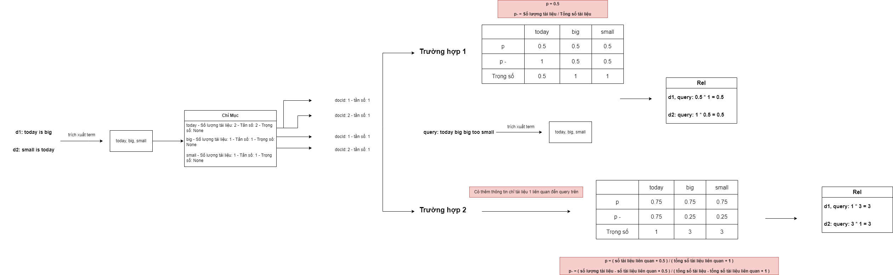

## *2.5. Đánh giá BIM*
### Ưu điểm

Dựa trên nền tảng lý thuyết vững chắc,

Về mặt lý thuyết, sơ đồ xếp hạng tối ưu hơn Vector Space. 

### Nhược điểm

Không sử dụng TF.

Tính toán khá nhiều.

# *Đánh giá các mô hình*

/Khúc này để cho đồ án chưa seminar/

Đa số người dùng sẽ không xem đến trang thứ 2, nên đánh giá dựa trên kết quả của 10 tài liệu đầu tiên