# Information Retrieval

# 1. Phân tích tài liệu
Giai đoạn đầu của quá trình xây dựng một hệ thống truy xuất thông tin đó chính là lọc các term trong bộ dữ liệu thông tin của hệ thống.

Một term có thể được hiểu là yếu tố cấu tạo thành tài liệu và sẽ được xác định tùy theo quan điểm phân tích tài liệu, ví dụ:
- Term là từ: face value -> face, value
- Term là khái niệm: face value -> face value ( mệnh giá )

Đối với project này, nhóm sẽ phân tích term dựa theo quan điểm:
- Term là một từ gốc (có thể không hoặc có nghĩa), không chứa số và kí hiệu đặc biệt: experimental -> experi, /destalling/ -> destal,...

Đầu tiên, ta sẽ tiến hành phân tích các bộ dữ liệu.

|       tài liệu      | số lượng txt | viết hoa |  số  | kí hiệu | stop words |
|:-------------------:|:------------:|:--------:|:----:|:-------:|:----------:|
|       Cranfield     |     1400     |    0     | 607  |   1398  |    1398    |
|       Nfcorpus      |     3612     |    0     |  0   |   3612  |     321    |

Các kí hiệu, stop words xuất hiện gần như trong toàn bộ txt của bộ Cranfield ( trừ 471.txt và 995.txt là 2 tệp txt trống ). Riêng stop words với số từ lặp lại với tần suất rất lớn, hình dưới đây là tần số 5 từ lặp lại nhiều nhất trong bộ Cranfield. 
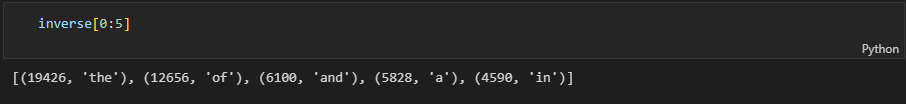

Đối với bộ Nfcorpus, nhóm sẽ sử dụng tập train của dữ liệu này đối với toàn bộ project. Về số lượng, Nfcorpus lớn gấp đôi Cranfield. Từ bảng trên có thể thấy, ta sẽ không cần áp dụng lọc số đối với bộ data này.

*Quá trình hình thành term từ kết quả phân tích trên*:

- Xóa tất cả các chữ số có trong tài liệu -> giúp giảm thiểu khối lượng chỉ mục và loại bỏ những số không có nghĩa.

- Xóa bỏ các kí hiệu không có nghĩa trong tài liệu.

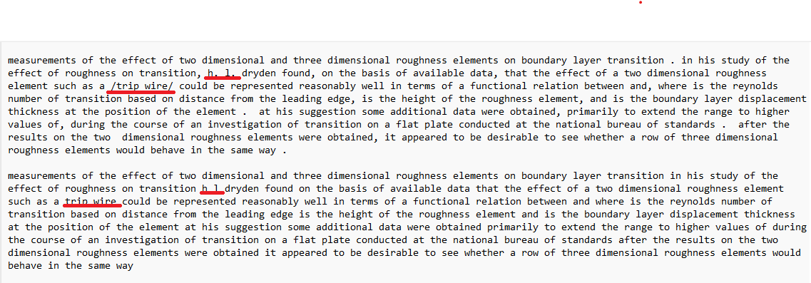

- Loại bỏ các từ stop words. Việc loại bỏ các từ stop words sẽ làm giảm kích cỡ của bộ dữ liệu, đồng thời xóa bỏ đi các từ không mang tính key words và vì các từ đó sẽ lặp lại với tần suất cao nên sẽ ảnh hưởng đến độ chính xác của hệ thống truy xuất.

- Trong quá trình phân tích tài liệu, nhóm nhận thấy có một số từ chỉ có 1-2 chữ không có nghĩa (từ viết tắt,...), nhóm cũng sẽ thực hiện xóa các chữ cái này.

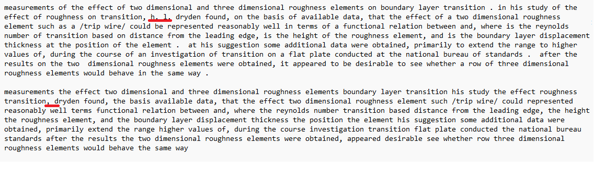

Ngoài những vấn đề trên, ta còn có thể áp dụng 2 kĩ thuật khác trong xử lý ngôn ngữ tự nhiên để làm giảm số lượng các từ, đó chính là Stemming và Lemmatization.

- Stemming là kỹ thuật dùng để biến đổi 1 từ về dạng gốc bằng cách cực kỳ đơn giản là loại bỏ 1 số ký tự nằm ở cuối từ mà nó nghĩ rằng là biến thể của từ. Ưu điểm của stemming là xử lý nhanh nhưng bù lại kết quả lại đôi khi không như mong muốn.

- Lemmatization đưa các từ về định dạng gốc được thực hiện bằng cách sử dụng một bảng tra cứu các từ vựng gốc. Nhược điểm là tốc độ xử lý khá chậm vì phải thực hiện tra cứu từ trong cơ sở dữ liệu, tuy nhiên bù lại độ chính xác sẽ được cải thiện.

Đối với project này, nhóm sẽ thực hiện cả 2 phương án Stemming và Lemmatization để thực hiện so sánh.

- 1. Đưa từ về từ gốc bằng PorterStemmer. Ở kĩ thuật này, nhóm sẽ lấy Stem một cách triệt để của từ, tức là stem một từ đến khi không thể stem được nữa. Ý nghĩa của điều này sẽ đưa các từ về cùng một trường từ vựng, ví dụ: experimental -> experi, experiment -> experi

- 2. Đưa từ về từ gốc bằng WordNetLemmatizer.

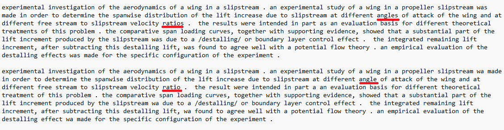

Số lượng term trên cả 2 bộ dữ liệu khi áp dụng chuẩn trên

|       tài liệu       |  Stem  | Lemma | 
|:--------------------:|:------:|:-----:|
|       Cranfield      |  4169  |  6022 |
|       Nfcorpus       |  15726 | 20761 |     

Qua bảng trên có thể thấy, khi sử dụng stem thì số lượng term ít hơn rất nhiều. Lí do là nhóm đã cải tiến kĩ thuật stem để stem một từ nhiều lần.

# 2. Mô hình Vector Space
## 2.1. Ý tưởng
Ý tưởng của mô hình Vector Space là biểu diễn văn bản và các câu truy vấn dưới dạng các vector term với cơ sở rằng nếu 2 vector trong không gian càng gần nhau thì độ liên quan giữa câu truy vấn đó và tài liệu tương ứng càng cao.

Ví dụ:

Tập tài liệu gồm:

- d1: today big

- d2: small today

Giả sử term tìm được trong tập tài liệu trên là today, big, small.

Tài liệu d1 sẽ được biểu diễn bằng vector có 3 trọng số: [W_today, W_big, W_small ]

Tương tự tài liệu d2 cũng sẽ được biểu diễn tương tự [ W1_today, W1_big, W1_small ]

Điều này cũng sẽ được áp dụng tương tự cho câu truy vấn (xem như là một vector) - [Wq_today, Wq_big, Wq_small ]. 

Cách xác định và tính weight cho vector là hết sức quan trọng, ảnh hưởng đến độ chính xác của các thuật toán xếp hạng. Việc các từ có trọng số khác nhau là do không phải các từ đều có sự quan trọng giống nhau, sử dụng số lần xuất hiện của các từ làm vector không phải là một cách tối ưu. Ở phương diện các documents, một vài từ có thể mang nhiều thông tin hơn các từ còn lại. Có rất nhiều cách để xác định trọng số term:

- Weight = tần số (tf): từ nào xuất hiện nhiều trong tài liệu thì càng quan trọng. Tuy nhiên, nếu có n thể hiện của một term trong tài liệu thì cũng không có ý nghĩa khẳng định rằng tài liệu đó quan trọng gấp n lần so với tài liệu khác.

- Weight = nghịch đảo tần số (idf): đây là cơ chế giảm ảnh hưởng của một term nếu nó xuất hiện quá nhiều lần trong bộ tài liệu. Trọng số idf là nghịch đảo của tuần suất xuất hiện của các từ trong các tài liệu. 

idf = log10(N+1/nk) 

Với nk là số tài liệu chứa term ở chiều thứ k. 

- Weight = tf.idf: kết hợp 2 độ đo trên, từ vừa xuất hiện nhiều lần trong câu, vừa không phải là từ phổ biến xuất hiện trong mọi câu.
    - Weight đạt giá trị lớn nhất khi: term đó xuất hiện nhiều lần trong một số lượng nhỏ tài liệu.
    - Thấp hơn khi t xuất hiện ít trong một tài liệu hoặc xuất hiện nhiều trong các tài liệu. 
    - Nhỏ nhất khi t xuất hiện trong mọi tài liệu,

Ví dụ:

- Tài liệu d1: [ 0.18, 0.48, 0 ]

- Tài liệu d2: [ 0.18, 0, 0.48 ]

Nhằm khắc phục tình trạng khác biệt giữa tài liệu dài và tài liệu ngắn, ta cần chuẩn hóa các trọng số vector về miền trọng số [0,1] bằng cách chia cho căn tổng bình phương trọng số các term.

Ví dụ:

- Tài liệu d1: [ 0.35, 0.94, 0 ]

- Tài liệu d2: [ 0.35, 0, 0.94 ]

Để xếp hạng các tài liệu liên quan đến câu truy vấn, ta cần tính độ liên quan của câu truy vấn đến từng tài liệu trong cơ sở dữ liệu bằng cách xác định khoảng cách giữa 2 vector (doc - query) hoặc tính góc tạo bởi 2 vector đó. 

Hình dưới đây mô tả lại ý tưởng của mô hình Vector Space:

Tuy nhiên, sẽ rất khó khăn nếu ta sử dụng mô hình gốc như thế vì đối với bộ dữ liệu lớn sẽ sinh ra vector có số chiều nhiều, gây khó khăn trong việc truy xuất và tốn thời gian tính toán. Do đó, nhóm đề xuất một số phương pháp cải tiến như sau:

- Giảm chiều của vector tài liệu và truy vấn
- Thay đổi cách tính độ đo giữa các vector

## *2.2. Lập chỉ mục*
Ở bước này sẽ sử dụng các term để mô tả góc nhìn logic của tài liệu để xây dựng các chỉ mục nhằm tăng tốc độ truy nhập. 

Cấu trúc chỉ mục sẽ có dạng: word -> từ điển -> posting list.

Từ điển sẽ chứa các thông tin: số lượng tài liệu chứa từ vựng và số lần xuất hiện của từ vựng đó trong toàn bộ tập lưu trữ.

Posting list gồm: chứa chỉ số tài liệu, số lần xuất hiện của term trong tài liệu đó và trọng số.

Ví dụ: Các term trong txt1 và txt7 trong bộ dữ liệu Cranfield theo kĩ thuật Stem

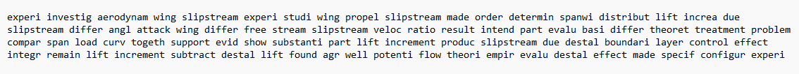

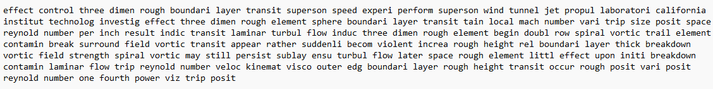

*Các bước lập chỉ mục như sau:*

Tạo một dict rỗng và lần lượt duyệt từng txt của tài liệu.

Với mỗi term, nếu term đó chưa từng xuất hiện trong dict, ta sẽ thêm vào dict term đó với dạng sau: 

word: { "Số lượng tài liệu": 1, "Tần số": 1, "Posting": con trỏ  } -> Posting: [docID, 1, 0]

- Với từ 'experi' đầu tiên sẽ được có dạng như sau:

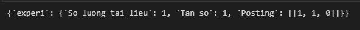

Nếu term đã xuất hiện trong dict thì ta cần xét đến 2 trường hợp:
- Term đó lặp lại trong cùng một docID: ta sẽ cộng giá trị "Tần số" cho dict lên 1 và cộng 1 cho riêng Posting của docID đó. Khi duyệt hết txt1, một phần của chỉ mục có dạng sau (từ experi lặp lại 3 lần):

- Term đó xuất hiện lại ở một docID khác: ta cũng thực hiện cộng giá trị "Tần số" cho dict lên 1 đồng thời tăng "Số lượng tài liệu" lên 1 và thêm vào Posting list của term đó như sau:  [docID, 1, 0]. Hình dưới mô tả chỉ mục khi duyệt đến từ 'experi' trong txt7.

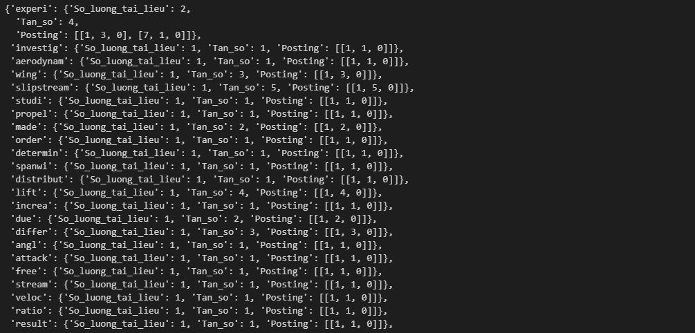

Sau khi đã duyệt hết bộ dữ liệu, ta bắt đầu tính trọng số cho từng term.

Với mỗi term trong từ điển, ta truy cập vào Posting list của nó. Mỗi docID tương ứng, weight = tf * idf ( đã trình bày ). 

Ví dụ: 

W_experi[docID = 1] = 3 * log10((2+1) / 2 ) =  0.52 

W_experi[docID = 7] = 1 * log10((2+1) / 2 ) =  0.18

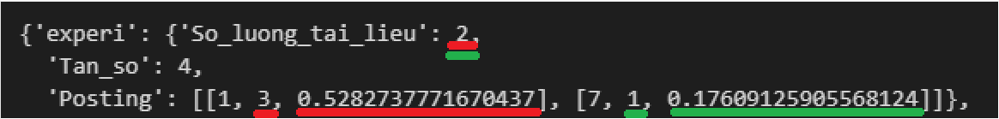

Cuối cùng, ta thực hiện chuẩn hóa bằng cách chia cho căn tổng bình phương các term trọng số trong docID tương ứng của nó.

## *2.4 Truy xuất chỉ mục*
Ở bước đầu trong giai đoạn truy xuất của hệ thống, câu truy vấn sẽ được xử lý tương tự như tài liệu, tức là quy trình lọc chữ số -> loại bỏ các kí hiệu ...-> hình thành các terms. 

Công thức tính cos giữa 2 vector như sau:

Do ở bước lập chỉ mục, ta đã thực hiện chuẩn hóa trọng số của các term trong tài liệu, vì thế ||doci|| = 1. Ngoài ra, việc tính toán độ liên quan được thực hiện dựa trên việc so sánh vector truy vấn đến lần lượt các doci nên vector truy vấn là không đổi và ||query|| = constant. Lúc này, việc tính toán độ liên quan được đơn giản hóa bằng:

similarity = Vector Doc_i * Vector Query 

Ví dụ với câu truy vấn 1: *similar law must obey construct aeroelast model heat high speed aircraft*

Đầu tiên ta sẽ tạo một dict rỗng để lưu trữ score giữa truy vấn và tài liệu.

Ta sẽ duyệt từng term trong câu truy vấn:

- Nếu term đó không tồn tại trong chỉ mục, ta sẽ bỏ qua vì term này không có ý nghĩa.

- Nếu term đó có trong chỉ mục, ta sẽ tính trọng số của term đó trong câu truy vấn = tần số của term đó trong truy vấn nhân với idf của term đó trong tập tài liệu. Ví dụ: 'similar' có tần số trong câu truy vấn là 1 và idf trong chỉ mục 0.78 => Trọng số trong truy vấn của 'similar' là 1*0.78 = 0.78

Tiếp đến, ta sẽ truy cập vị trí của term đó trong chỉ mục để lấy Posting list. Lần lượt xét các docID trong Posting list:
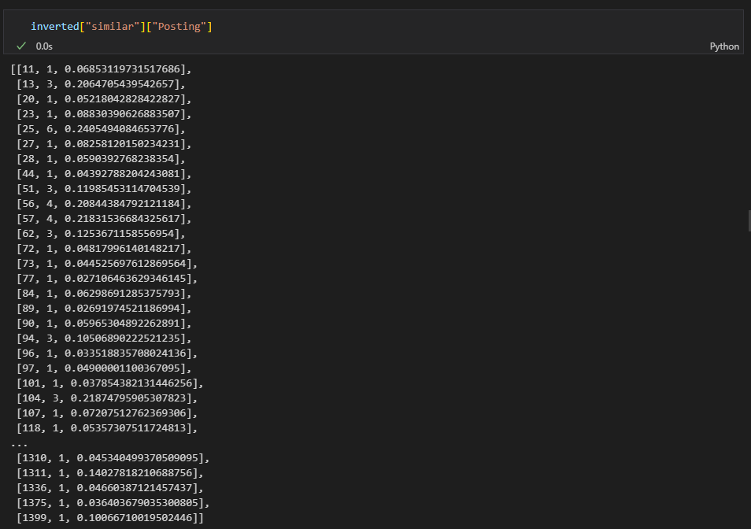

- Nếu docID đó chưa xuất hiện trong dict: ta sẽ thêm vào dict một phần tử có dạng docID : score (trọng số term trong câu truy vấn * weight trong Posting list tại vị trí này). Ví dụ: docID 11 chưa xuất hiện trong dict, ta thêm vào dict một score = 0.78 * 0.07 = 0.05. Hình dưới đây thể hiện giá trị của dict sau khi duyệt term 'similar' (do từ đầu tiên nên chắc chắn các docID được thêm vào dict bằng trường hợp này).

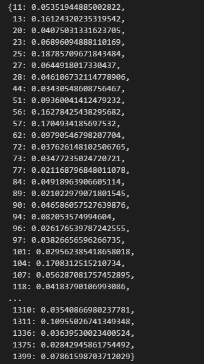

- Nếu docID đã tồn tại trong dict: ta cộng vào vị trí docID đó một score với cách tính như trên. Ví dụ với từ 'law' tiếp theo, từ này có xuất hiện ở docID 13 với score = 1 *  1.18 * 0.2 = 0.24. Lúc này dict[13] = dict[13] + 0.24 = 0.16 + 0.24 = 0.4. Hình dưới đây thể hiện giá trị của dict sau khi duyệt term 'law'  

Cứ tiếp tục như vậy đến hết câu truy vấn, ta sẽ được một dict gồm các tài liệu liên quan. Cuối cùng, ta sắp xếp dict này theo thứ tự giảm dần các score.

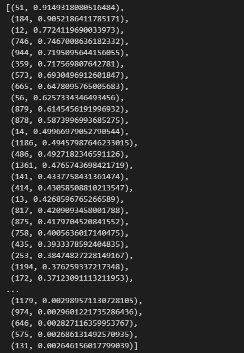

## *1.5. Đánh giá mô hình Vector Space*

### Ưu điểm

Dễ hiểu và dễ cài đặt.

Có nhiều các tính trọng số và độ liên quan khác nhau.

### Nhược điểm

Phải cân nhắc lựa chọn các cách tính phù hợp.

# Mô hình BIM
Mô hình độc lập nhị phân ( Binary Independence Model ) là mô hình truy xuất thông tin dựa trên xác suất.

Sự liên quan của truy vấn và tài liệu được biểu diễn thể hiện trong biến nhị phân:

- R = 1 - d,q có liên quan.
- R = 0 - d,q không liên quan.

Kết quả xếp hạng sẽ được sắp xếp theo thứ tự giảm dần của xác suất p(R=1|d,q) ( xác suất để d,q có liên quan 
nhau là p ). Một khác xếp hạng khác là ta có thể xếp hạng theo odds.

Từ biểu thức trên, ta áp dụng quy tắc Bayes với 3 sự kiện

Trong đó, p(R=1|q) và p(R=0|q) là hằng số, do đó, việc xếp hạng bây giờ sẽ phụ thuộc vào 2 giá trị p(d|R=1,q) và p(d|R=0,q), tỉ số giữa 2 giá trị này được gọi là trọng số của term (sẽ trình bày ở mục 2).

Với mô hình BIM tồn tại các giả định đển việc ước lượng 2 giá trị trên đơn giản và hiệu quả:

- Các term trong một tài liệu và một truy vấn độc lập với nhau.

- Xác suất của một term xuất hiện trong các tài liệu liên quan không ảnh hưởng đến xác suất của các term khác trong các tài liệu liên quan.

Từ đó ta có

Và giả định:

- Các term của câu truy vấn là yếu tố duy nhất xác định sự liên quan giữa tài liệu và truy vấn. Giả sử với term i của tài liệu không có trong câu truy vấn thì:

p(term_i|q, R = 1 ) = p(term_i|q, R = 0 ) 

Do đó ta chỉ cần tính những term thuộc câu truy vấn, vậy sự liên quan của tài liệu và truy vấn sẽ được thể hiện như sau:

Do di nhận giá trị nhị phân nên:

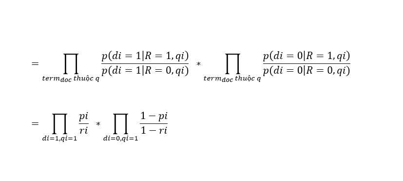

Tiếp tục phân tích, ta được:

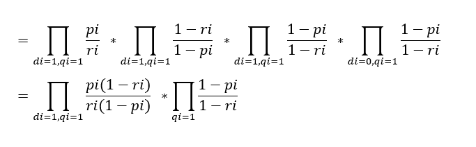

Dễ nhận thấy, phần bên phải của công thức nhân là hằng số, do đó ta có thể bỏ qua giá trị này. Sau khi đã lược bỏ, ta thấy rằng giá trị odds xếp hạng lúc này chỉ phụ thuộc vào vị trí term đó xuất hiện trong câu truy vấn và xuất hiện trong cả tài liệu (di=1,qi=1).

*Tính trọng số cho các term*

Tổng quát ta có:

|       tài liệu      | liên quan | không liên quan | tổng |
|:-------------------:|:---------:|:---------------:|:----:|
|        di = 1       |     Rt    |       Nt-Rt     |  Nt  |
|        di = 0       |    Nr-Rt  |     N-Nr-Nt+Rt  | N-Nt |
|        tổng         |     Nr    |       N-Nr      |  N   |

Với:

- Rt: số tài liệu có liên quan chứa term di.
- Nr: tổng số tài liệu có liên quan.
- Nt: Nt là tổng số tài liệu chứa term di.
- N: tổng số tài liệu.

Vậy: 

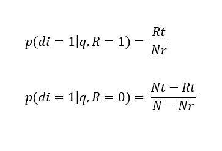

Việc tính weight các term sẽ được tính theo 2 trường hợp:
- Trường hợp chúng ta không có thông tin rằng tài liệu nào là có liên quan hoặc không (chưa biết Nr,...). Thông tin duy nhất chúng ta biết là từ câu truy vấn và ta không có cách nào để ước tính được term của câu truy vấn xuất hiện như thế nào (tần số) trong các tài liệu liên quan, do đó, ta có 2 giả định:
    - Term của truy vấn xuất hiện hay không xuất hiện trong tài liệu liên quan là như nhau: Rt = Nr-Rt -> p(term_i|q, R = 1 ) = 0.5

    - Các tài liệu liên quan chiếm tỉ lệ rất nhỏ trong bộ tài liệu (do không có thông tin) nên Nr ~ 0 -> Rt ~ 0 => p(term_i|q, R = 0 ) = Nt / N ( số tài liệu chứa term / tổng tài liệu).

Ví dụ:

Tập tài liệu:
- d1: today big
- d2: small today
- Câu truy vấn: today big small

|                     | today | big | small |
|:-------------------:|:-----:|:---:|:-----:|
| p(term_doc \|R=1,q) |  0.5  | 0.5 |  0.5  |
| p(term_doc \|R=0,q) |   1   | 0.5 |  0.5  |
|        weight       |  0.5  |  1  |   1   |

- Trường hợp chúng ta biết được một số thông tin về các tài liệu liên quan (tập training, phản hồi từ người dùng,...) (Có thông tin về Nr,...)
  

   Lúc này, p(term_i|q, R = 1 ) = Rt/Nr = (Rt+0.5) / (Nr+1) (smoothing để tránh Rt = 0 hoặc Rt = Nt ).

   Và p(term_i|q, R = 0 ) =  (Nt-Rt)/(N-Nr) = (Nt-Rt + 0.5)/(N-Nr + 1) (smoothing) với Nt là tổng số tài liệu chứa term.

Ví dụ:
Giả sử như ta vừa đưa ra kết quả truy xuất là có d1, d2 liên quan đến câu truy vấn từ bảng trọng số trên. Và người dùng phản hồi lại cho cho ta là chỉ có d1 là liên quan đến câu truy vấn, lúc này, ta thực hiện cập nhật lại bảng trọng số như sau.
- Có Nr = 1 (d1) tài liệu liên quan cho câu truy vấn trên và:
    - R_today = 1, N_today = 1
    - R_big = 1, N_big = 1
    - R_small = 0, N_small = 0

|                     | today | big  | small |
|:-------------------:|:-----:|:---: |:-----:|
| p(term_doc \|R=1,q) |  0.75 | 0.75 |  0.75 |
| p(term_doc \|R=0,q) |  0.75 | 0.25 |  0.25 |
|        weight       |   1   |  3   |   3   |

Với 

## *2.3. Lập chỉ mục*
Chỉ mục trong BIM sẽ có dạng word -> từ điển -> posting list -> weight.

Từ điển sẽ chứa các thông tin: số lượng tài liệu chứa từ vựng và số lần xuất hiện của từ vựng đó trong toàn bộ tập lưu trữ.

Posting list gồm: chứa chỉ số tài liệu, số lần xuất hiện của một từ khóa trong tài liệu đó.

Weight sẽ chứa thông tin trọng số với cách tính như mục 2.2

Ví dụ: Các term trong txt1 và txt7 trong bộ dữ liệu Cranfield theo kĩ thuật Stem

*Các bước lập chỉ mục như sau:*

Tạo một dict rỗng và lần lượt duyệt từng txt của tài liệu.

Với mỗi term, nếu term đó chưa từng xuất hiện trong dict, ta sẽ thêm vào dict term đó với dạng sau: 

word: { "Số lượng tài liệu": 1, "Tần số": 1, "Posting": con trỏ  } -> Posting: [docID, 1]

- Với từ 'experi' đầu tiên sẽ được có dạng như sau:

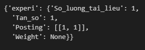

Nếu term đã xuất hiện trong dict thì ta cần xét đến 2 trường hợp:
- Term đó lặp lại trong cùng một docID: ta sẽ cộng giá trị "Tần số" cho dict lên 1 và cộng 1 cho riêng Posting của docID đó. Khi duyệt hết txt1, một phần của chỉ mục có dạng sau (từ experi lặp lại 3 lần):

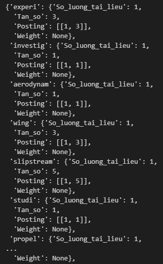

- Term đó xuất hiện lại ở một docID khác: ta cũng thực hiện cộng giá trị "Tần số" cho dict lên 1 đồng thời tăng "Số lượng tài liệu" lên 1 và thêm vào Posting list của term đó như sau:  [docID, 1, 0]. Hình dưới mô tả chỉ mục khi duyệt đến từ 'experi' trong txt7.

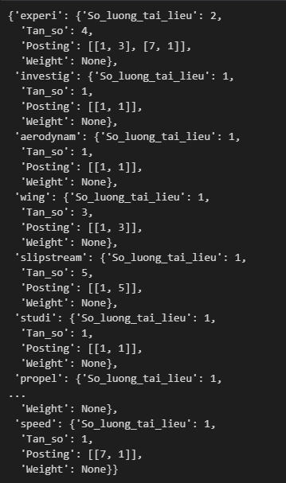

Sau khi đã duyệt hết bộ dữ liệu, ta bắt đầu tính trọng số cho từng term.

Với mỗi term trong từ điển, ta tính trọng số như đã trình bày ở phần trên.

Ví dụ:

W_experi = log2(0.5 / ('So_luong_tai_lieu' / Tổng txt )) = log2( 0.5 / ( 2/2 )) = -1

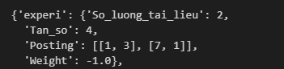

## *2.4 Truy xuất chỉ mục*
Với bước đầu trong xử lý truy vấn, ta cũng phân tích câu truy vấn thành các term. 

Ví dụ với câu truy vấn 1: *similar law must obey construct aeroelast model heat high speed aircraft*

Tương tự như mô hình Vector Space, ta cũng tạo một dict rỗng để lưu trữ score.

Ta sẽ duyệt từng term trong câu truy vấn:

- Nếu term đó không tồn tại trong chỉ mục, ta sẽ bỏ qua.

- Nếu term đó có trong chỉ mục, ta truy cập vào Posting list của nó để lấy danh sách các docID. 

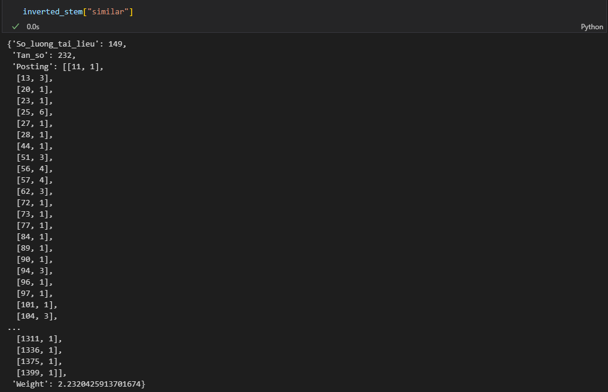

Tương ứng với các docID, ta có 2 trường hợp:

 - docID chưa xuất hiện trong dict: ta sẽ thêm vào dict một phần tử có dạng docID : weight (của term đó)

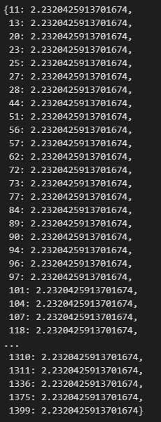

Nếu docID đã tồn tại trong dict: ta cộng vào vị trí docID đó một score với cách tính như trên. Ví dụ với từ 'law' tiếp theo, từ này có xuất hiện ở docID 13 với weight['law'] = 3.72 . Lúc này dict[13] = dict[13] + 3.72 = 2.23 + 3.72 = 5.95. Hình dưới đây thể hiện giá trị của dict sau khi duyệt term 'law'.

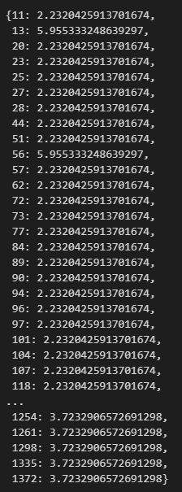

Cứ tiếp tục như vậy đến hết câu truy vấn, ta sẽ được một dict gồm các tài liệu liên quan. Cuối cùng, ta sắp xếp dict này theo thứ tự giảm dần các score.

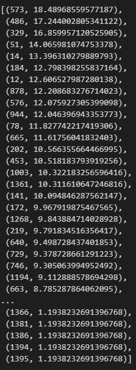

## *2.5. Đánh giá BIM*

### Ưu điểm

Dựa trên nền tảng lý thuyết vững chắc

Về mặt lý thuyết, sơ đồ xếp hạng tối ưu hơn Vector Space. 

### Nhược điểm

Không sử dụng TF.

Tính toán khá nhiều.

# *Đánh giá hiệu quả của các mô hình*

Hiệu quả của các mô hình thể hiện khả năng đáp ứng của kết quả truy xuất đối với câu truy vấn. Các độ đo truy xuất phổ biến là độ chính xác (Precision) và độ bao phủ (Recall). 

- Độ chính xác: là tỷ lệ tài liệu được thu thập có liên quan.
- Độ bao phủ: là tỷ lệ tài liệu có liên quan được thu thập.

Nhược điểm của 2 độ đo này là việc kiểm tra tất cả kết quả trả về của hệ thống truy xuất là không có ý nghĩa vì thực tế, đa số người dùng chỉ quan tâm đến kết quả của 10 tập tài liệu trả về. Do đó, để khắc phục điều này, nhóm sẽ sử dụng phương pháp chia cắt với 10 tài liệu đầu tiên.

Ngoài ra, nhóm còn sử dụng phương pháp MAP nội suy 11 điểm để đánh giá.

*Mô hình Vector Space*

Bảng so sánh giữa 2 kĩ thuật Stem và Lemma với bộ dữ liệu Cranfield

|                           | Stem | Lemma | 
|:-------------------------:|:----:|:-----:|
|      Số lượng từ          | 4169 |  6022 |
|    Thời gian lập chỉ mục  | 0.25 |  0.26 |  
|     Số lượng câu truy vấn | 225  |  225  |
|    Thời gian truy xuất    | 0.24 |  0.21 | 
|         Precision@10      | 0.3  | 0.3   |
|          Recall@10        | 0.43 |  0.42 |

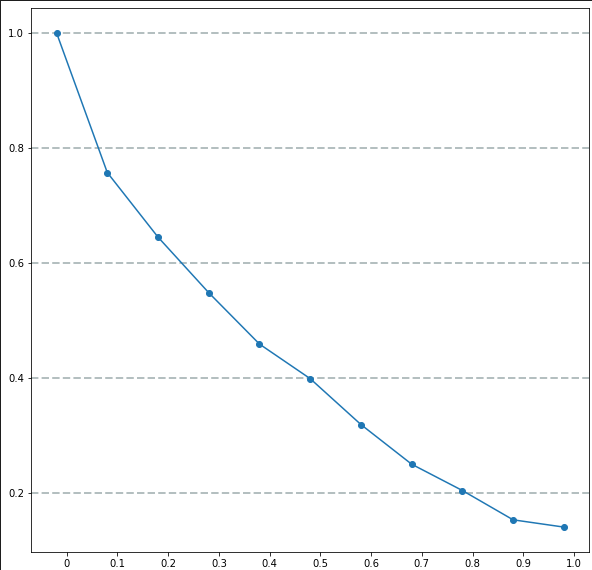
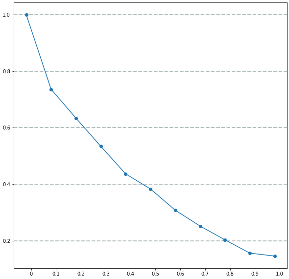

Bảng so sánh giữa 2 kĩ thuật Stem và Lemma với bộ dữ liệu Nfcorpus

|                           |   Stem   |  Lemma   | 
|:-------------------------:|:--------:|:--------:|
|      Số lượng từ          | 15726    |  20761   |
|    Thời gian lập chỉ mục  | 0.64     |  0.66    |
|     Số lượng câu truy vấn | 2594     |  2594    |  
|    Thời gian truy xuất    |   47.27  |  40.25   | 
|         Precision@10      |  0.219   |  0.217   |
|          Recall@10        |  0.1     |  0.1     |
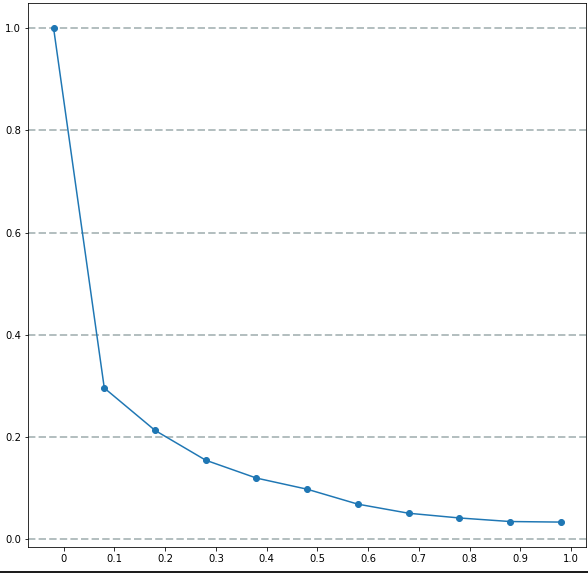
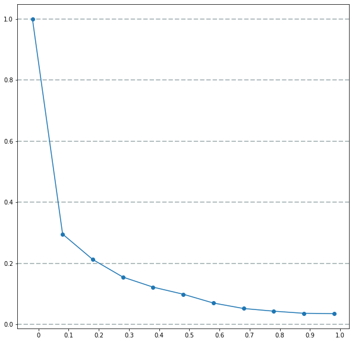

*Mô hình BIM*

Bảng so sánh giữa 2 kĩ thuật Stem và Lemma với bộ dữ liệu Cranfield

|                           | Stem | Lemma | 
|:-------------------------:|:----:|:-----:|
|      Số lượng từ          | 4169 |  6022 |
|    Thời gian lập chỉ mục  | 0.07 |  0.09 |
|     Số lượng câu truy vấn | 225  |  225  |  
|    Thời gian truy xuất    | 0.2  |  0.16 | 
|         Precision@10      | 0.26 | 0.25  |
|          Recall@10        | 0.38 |  0.37 |

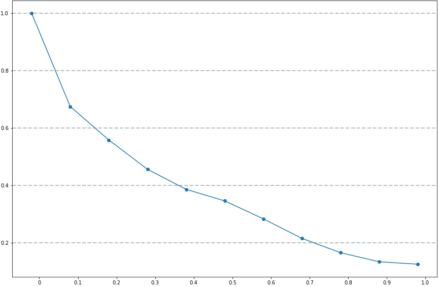
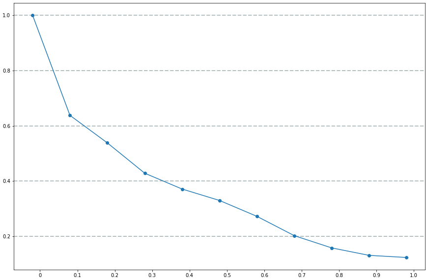

Bảng so sánh giữa 2 kĩ thuật Stem và Lemma với bộ dữ liệu Nfcorpus

|                           |   Stem   |  Lemma   | 
|:-------------------------:|:--------:|:--------:|
|      Số lượng từ          | 15726    |  20761   |
|    Thời gian lập chỉ mục  | 0.39     |  0.67    |
|     Số lượng câu truy vấn | 2594     |  2594    |  
|    Thời gian truy xuất    |   129.9  |  127.83  | 
|         Precision@10      |  0.16    |  0.16    |
|          Recall@10        |  0.08    |  0.08    |

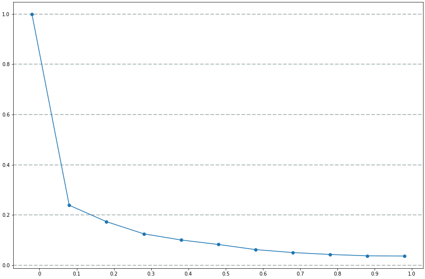

Dựa vào kết quả trên, nhóm rút ra một số nhận xét sau:

- Mô hình Vector Space có thời gian lập chỉ mục lâu hơn BIM, vì ở Vector Space cần phải tính weight cho từng term của mỗi docID khác nhau trong Posting List tương ứng. Ngược lại, ở BIM, mỗi term chỉ có một số weight duy nhất.

- 

